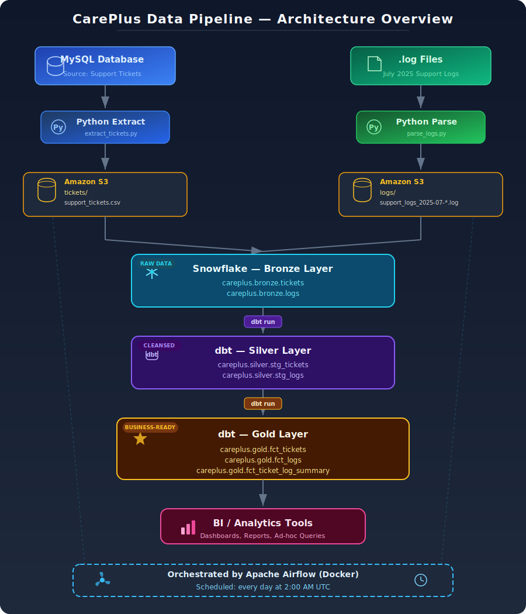

# CarePlus Data Pipeline

A production-grade end-to-end data pipeline that ingests support ticket data from MySQL and application log files, stages them in Amazon S3, loads them into Snowflake, transforms them using dbt following the Medallion Architecture (Bronze → Silver → Gold), and orchestrates everything with Apache Airflow running in Docker — scheduled to run daily at 2AM.

---

## Table of Contents

- [Architecture Overview](#architecture-overview)
- [Tech Stack](#tech-stack)
- [Project Structure](#project-structure)
- [Data Sources](#data-sources)
- [Medallion Architecture](#medallion-architecture)
- [Pipeline Flow](#pipeline-flow)
- [Data Models](#data-models)
- [Data Quality](#data-quality)
- [Setup & Installation](#setup--installation)
- [Running the Pipeline](#running-the-pipeline)
- [Airflow DAG](#airflow-dag)
- [Incremental Loading](#incremental-loading)
- [Environment Variables](#environment-variables)

---

## Architecture Overview
## Architecture


---

## Tech Stack

| Component | Tool | Purpose |
|---|---|---|
| Source Database | MySQL | Stores support tickets |
| Log Files | `.log` files | Application event logs |
| Cloud Storage | Amazon S3 | Staging area for raw files |
| Data Warehouse | Snowflake | Central data store |
| Transformation | dbt (Snowflake adapter) | Silver and gold layer models |
| Orchestration | Apache Airflow 2.9.1 | DAG scheduling and monitoring |
| Containerization | Docker + Docker Compose | Airflow runtime environment |
| Language | Python 3.12 | Extraction and parsing scripts |
| Infrastructure | AWS IAM | S3 access control |

---

## Project Structure

```
careplus_pipeline/
├── ingestion/
│   ├── upload_logs_to_s3.py          # Uploads .log files from local to S3
│   ├── load_logs_to_snowflake.py     # Parses .log files from S3, loads into bronze.logs
│   └── load_tickets_to_snowflake.py  # Extracts MySQL tickets, uploads to S3, loads into bronze.tickets
│
├── dbt/
│   └── careplus_dbt/
│       ├── dbt_project.yml           # dbt project configuration
│       ├── profiles.yml              # Snowflake connection profile
│       ├── macros/
│       │   └── generate_schema_name.sql  # Custom schema macro (prevents schema concatenation)
│       └── models/
│           ├── silver/
│           │   ├── sources.yml       # Bronze source definitions
│           │   ├── stg_tickets.sql   # Cleaned tickets model
│           │   └── stg_logs.sql      # Cleaned logs model
│           └── gold/
│               ├── fct_tickets.sql            # Enriched tickets fact table
│               ├── fct_logs.sql               # Enriched logs fact table
│               └── fct_ticket_log_summary.sql # Tickets joined with log metrics
│
├── airflow/
│   ├── Dockerfile                    # Custom Airflow image with pipeline dependencies
│   ├── docker-compose.yaml           # Airflow services (webserver, scheduler, worker, redis, postgres)
│   ├── .env                          # Airflow + pipeline environment variables
│   └── dags/
│       └── careplus_pipeline.py      # Main Airflow DAG
│
├── .env                              # Local environment variables
├── .gitignore
└── README.md
```

---

## Data Sources

### 1. MySQL — Support Tickets
- **Database:** `careplus_support_db`
- **Table:** `support_tickets`

| Column | Type | Description |
|---|---|---|
| ticket_id | text | Unique ticket identifier (e.g. TCK0701000) |
| created_at | text | Ticket creation timestamp |
| resolved_at | text | Ticket resolution timestamp (NULL if open) |
| agent | text | Agent who handled the ticket |
| priority | text | Ticket priority (High, Medium, Low) |
| num_interactions | text | Number of interactions on the ticket |
| IssUeCat | text | Issue category |
| channel | text | Support channel (Chat, Phone, Web Form) |
| status | text | Ticket status (Open, Resolved) |
| agent_feedback | text | Feedback left by the agent |

**Volume:** 810 tickets covering July 2025

---

### 2. Log Files — Application Events
- **Format:** Custom multi-line `.log` files
- **Coverage:** July 1–31, 2025 (31 files, one per day)
- **Location:** `s3://careplus-pipeline-seyi/logs/`

Each log entry is a 6-line block separated by `---`:

```
2025-07-01 00:21:00 [INFO] careplus.support.GenericService - TicketID=TCK0701000 SessionID=sess_TCK0701000
IP=60.130.155.7 | ResponseTime=1269ms | CPU=27.64% | EventType=generic_event | Error=false
UserAgent="PostmanRuntime/7.32.2"
Message=" event for TCK0701000"
Debug="ℹ️ Logged for monitoring"
TraceID=None
---
```

**Volume:** 2,650 raw log events across 31 files

---

## Medallion Architecture

This pipeline follows the **Bronze → Silver → Gold** medallion architecture pattern:

### Bronze Layer — Raw Data
- Data is loaded **exactly as it came from the source** — no transformations, no cleaning
- Dirty data, duplicates, and invalid values are all preserved
- Serves as the source of truth and audit trail
- Tables: `careplus.bronze.tickets`, `careplus.bronze.logs`

### Silver Layer — Cleaned Data
- dbt **views** built on top of bronze
- Applies cleaning, standardization, and deduplication
- No data is deleted — invalid values are nulled or standardized
- Tables: `careplus.silver.stg_tickets`, `careplus.silver.stg_logs`

### Gold Layer — Analytics-Ready Data
- dbt **tables** built on top of silver
- Business logic applied — derived columns, bucketing, aggregations
- Joined and enriched models ready for BI tools
- Tables: `careplus.gold.fct_tickets`, `careplus.gold.fct_logs`, `careplus.gold.fct_ticket_log_summary`

---

## Pipeline Flow

### Step 1 — Tickets (MySQL → S3 → Snowflake Bronze)
1. Python connects to MySQL and extracts new/updated tickets since the last run (incremental)
2. Writes extracted rows to an in-memory CSV buffer
3. Uploads CSV to `s3://careplus-pipeline-seyi/tickets/support_tickets.csv`
4. Snowflake uses `COPY INTO` to load from S3 into `careplus.bronze.tickets`

### Step 2 — Logs (S3 → Snowflake Bronze)
1. Python reads `.log` files directly from S3 into memory (no local download)
2. Each 6-line block is parsed into a structured row using regex
3. Raw rows (including dirty data) are bulk-inserted into `careplus.bronze.logs`
4. On subsequent runs, the script skips loading if data already exists (one-time historical load)

### Step 3 — dbt Silver
1. `stg_tickets` — normalizes dirty priority values (`Lw` → `Low`, `Medum` → `Medium`, `Hgh` → `High`), nulls invalid `num_interactions`, adds `resolution_time_mins` and `is_open` derived columns
2. `stg_logs` — normalizes inconsistent log levels (`INF0` → `INFO`, `DEBG` → `DEBUG`, `EROR` → `ERROR`, `warnING` → `WARNING`), nulls negative `response_time_ms`, removes duplicate log entries using `QUALIFY ROW_NUMBER()`

### Step 4 — dbt Gold
1. `fct_tickets` — adds `created_date`, `created_day_of_week`, `created_hour`, and `resolution_bucket` columns
2. `fct_logs` — adds `log_date`, `log_hour`, `response_bucket` (Fast/Normal/Slow), and `cpu_load` (Low/Medium/High) columns
3. `fct_ticket_log_summary` — joins tickets with aggregated log metrics per ticket (total events, avg response time, error counts, warning counts)

---

## Data Models

### `careplus.gold.fct_tickets`
One row per support ticket, fully enriched.

| Column | Description |
|---|---|
| ticket_id | Unique ticket identifier |
| created_at | Ticket creation timestamp |
| resolved_at | Resolution timestamp (NULL if open) |
| agent | Handling agent |
| priority | Normalized priority (High/Medium/Low) |
| num_interactions | Cleaned interaction count (NULL if invalid) |
| issue_cat | Issue category |
| channel | Support channel |
| status | Open or Resolved |
| agent_feedback | Agent feedback |
| resolution_time_mins | Minutes from creation to resolution |
| is_open | Boolean — TRUE if ticket is unresolved |
| created_date | Date portion of created_at |
| created_day_of_week | Day name (Monday, Tuesday, etc.) |
| created_hour | Hour of day ticket was created |
| resolution_bucket | Under 1 hour / Under 1 day / Under 3 days / Over 3 days |

---

### `careplus.gold.fct_logs`
One row per log event, deduplicated and enriched.

| Column | Description |
|---|---|
| timestamp | Log event timestamp |
| log_level | Normalized level (INFO/DEBUG/ERROR/WARNING) |
| service | Service that generated the log |
| ticket_id | Associated ticket |
| session_id | Session identifier |
| ip | Client IP address |
| response_time_ms | Response time in ms (NULL if negative) |
| cpu_percent | CPU utilization at time of event |
| event_type | Type of event |
| error | Boolean error flag |
| user_agent | Client user agent |
| trace_id | Trace identifier (NULL if none) |
| log_date | Date portion of timestamp |
| log_hour | Hour of day |
| response_bucket | Fast (<500ms) / Normal (<1000ms) / Slow (≥1000ms) |
| cpu_load | Low (<50%) / Medium (<80%) / High (≥80%) |

---

### `careplus.gold.fct_ticket_log_summary`
One row per ticket with aggregated log metrics — the primary analytics table.

| Column | Description |
|---|---|
| ticket_id | Unique ticket identifier |
| created_at, resolved_at | Ticket timestamps |
| agent, priority, issue_cat, channel, status | Ticket attributes |
| resolution_time_mins, resolution_bucket | Resolution metrics |
| is_open | Whether the ticket is still open |
| total_log_events | Total log entries for this ticket |
| avg_response_time_ms | Average response time across all log events |
| max_response_time_ms | Peak response time |
| avg_cpu_percent | Average CPU utilization |
| total_errors | Count of error events |
| total_warnings | Count of warning events |
| total_debug_events | Count of debug events |
| first_log_at | Timestamp of first log event |
| last_log_at | Timestamp of last log event |

---

## Data Quality

### Issues Found in Source Data (Preserved in Bronze, Fixed in Silver)

| Issue | Source | Bronze | Silver Fix |
|---|---|---|---|
| Inconsistent log levels (`INF0`, `DEBG`, `EROR` `warnING`) | logs | Raw as-is | Normalized to `INFO`, `DEBUG`, `ERROR`, `WARNING` |
| Negative response times (e.g. `-749ms`) | logs | Raw as-is | Nulled out |
| Duplicate log entries (same timestamp + ticket + IP) | logs | Raw as-is | Removed with `QUALIFY ROW_NUMBER()` |
| Invalid priority values (`Lw`, `Medum`, `Hgh`) | tickets | Raw as-is | Normalized to `Low`, `Medium`, `High` |
| Invalid num_interactions (`-999999`) | tickets | Raw as-is | Nulled out |
| NULL resolved_at on open tickets | tickets | Raw as-is | Preserved as NULL, `is_open = TRUE` |

---

## Setup & Installation

### Prerequisites
- Python 3.12+
- Docker Desktop
- AWS Account with IAM user
- Snowflake Account
- MySQL (local or remote)

### 1. Clone the Repository
```bash
git clone https://github.com/yourusername/careplus-pipeline.git
cd careplus-pipeline
```

### 2. Create Virtual Environment
```bash
python3 -m venv venv
source venv/bin/activate
pip install boto3 snowflake-connector-python mysql-connector-python dbt-snowflake python-dotenv
```

### 3. Configure Environment Variables
```bash
cp .env.example .env
nano .env
```

Fill in your credentials (see [Environment Variables](#environment-variables) section).

### 4. Set Up Snowflake
Run the following in your Snowflake worksheet as ACCOUNTADMIN:

```sql
-- Database and schemas
CREATE DATABASE IF NOT EXISTS careplus;
CREATE SCHEMA IF NOT EXISTS careplus.bronze;
CREATE SCHEMA IF NOT EXISTS careplus.silver;
CREATE SCHEMA IF NOT EXISTS careplus.gold;

-- Warehouse
CREATE WAREHOUSE IF NOT EXISTS careplus_wh
  WITH WAREHOUSE_SIZE = 'X-SMALL'
  AUTO_SUSPEND = 60
  AUTO_RESUME = TRUE;

-- Role and user
CREATE ROLE IF NOT EXISTS careplus_role;
CREATE USER IF NOT EXISTS careplus_user
  PASSWORD = 'YourPassword!'
  DEFAULT_ROLE = careplus_role
  DEFAULT_WAREHOUSE = careplus_wh
  DEFAULT_NAMESPACE = careplus.bronze;

GRANT ROLE careplus_role TO USER careplus_user;
GRANT USAGE ON WAREHOUSE careplus_wh TO ROLE careplus_role;
GRANT USAGE ON DATABASE careplus TO ROLE careplus_role;
GRANT ALL PRIVILEGES ON SCHEMA careplus.bronze TO ROLE careplus_role;
GRANT ALL PRIVILEGES ON SCHEMA careplus.silver TO ROLE careplus_role;
GRANT ALL PRIVILEGES ON SCHEMA careplus.gold TO ROLE careplus_role;
GRANT ALL PRIVILEGES ON FUTURE TABLES IN DATABASE careplus TO ROLE careplus_role;
GRANT ALL PRIVILEGES ON FUTURE VIEWS IN DATABASE careplus TO ROLE careplus_role;
GRANT CREATE STAGE ON SCHEMA careplus.bronze TO ROLE careplus_role;

-- Raw tables
USE SCHEMA careplus.bronze;

CREATE TABLE IF NOT EXISTS tickets (
    ticket_id        VARCHAR,
    created_at       TIMESTAMP,
    resolved_at      TIMESTAMP,
    agent            VARCHAR,
    priority         VARCHAR,
    num_interactions INT,
    issue_cat        VARCHAR,
    channel          VARCHAR,
    status           VARCHAR,
    agent_feedback   VARCHAR,
    _loaded_at       TIMESTAMP DEFAULT CURRENT_TIMESTAMP
);

CREATE TABLE IF NOT EXISTS logs (
    timestamp        TIMESTAMP,
    log_level        VARCHAR,
    service          VARCHAR,
    ticket_id        VARCHAR,
    session_id       VARCHAR,
    ip               VARCHAR,
    response_time_ms INT,
    cpu_percent      FLOAT,
    event_type       VARCHAR,
    error            VARCHAR,
    user_agent       VARCHAR,
    trace_id         VARCHAR,
    _loaded_at       TIMESTAMP DEFAULT CURRENT_TIMESTAMP
);
```

### 5. Set Up AWS S3
```bash
# Install and configure AWS CLI
brew install awscli
aws configure

# Create S3 bucket and folders
aws s3api create-bucket --bucket your-bucket-name --region us-east-1
aws s3api put-object --bucket your-bucket-name --key logs/
aws s3api put-object --bucket your-bucket-name --key tickets/

# Block public access
aws s3api put-public-access-block \
  --bucket your-bucket-name \
  --public-access-block-configuration \
  "BlockPublicAcls=true,IgnorePublicAcls=true,BlockPublicPolicy=true,RestrictPublicBuckets=true"
```

### 6. Configure dbt
```bash
cd dbt/careplus_dbt
dbt debug  # verify connection
```

### 7. Start Airflow
```bash
cd airflow
docker compose up airflow-init
docker compose up -d
```

Access the Airflow UI at `http://localhost:8080` (username: `airflow`, password: `airflow`).

---

## Running the Pipeline

### Manual Run (without Airflow)
```bash
# Upload log files to S3 (one-time)
python ingestion/upload_logs_to_s3.py

# Load logs into Snowflake bronze
python ingestion/load_logs_to_snowflake.py

# Load tickets into Snowflake bronze
python ingestion/load_tickets_to_snowflake.py

# Run dbt transformations
cd dbt/careplus_dbt
dbt run --select silver
dbt run --select gold
```

### Via Airflow
1. Open `http://localhost:8080`
2. Find `careplus_pipeline` in the DAGs list
3. Toggle it on to unpause
4. Click the play button → **Trigger DAG**

---

## Airflow DAG

- **DAG ID:** `careplus_pipeline`
- **Schedule:** `0 2 * * *` (every day at 2AM)
- **File:** `airflow/dags/careplus_pipeline.py`

### Task Graph
```
load_tickets_to_snowflake --|
                            |--> dbt_run_silver --> dbt_run_gold
load_logs_to_snowflake    --|
```

### Tasks

| Task ID | Operator | Description |
|---|---|---|
| `load_tickets_to_snowflake` | BashOperator | Extracts MySQL tickets → S3 → bronze.tickets |
| `load_logs_to_snowflake` | BashOperator | Parses .log files from S3 → bronze.logs |
| `dbt_run_silver` | BashOperator | Runs dbt silver models (stg_tickets, stg_logs) |
| `dbt_run_gold` | BashOperator | Runs dbt gold models (fct_tickets, fct_logs, fct_ticket_log_summary) |

`load_tickets` and `load_logs` run in **parallel**. dbt silver runs only after both complete. dbt gold runs only after silver completes.

---

## Incremental Loading

The tickets pipeline uses **incremental loading** to avoid reprocessing historical data on every run.

**How it works:**
1. On each run, the script queries Snowflake for `MAX(created_at)` in `bronze.tickets`
2. If data exists, it only pulls MySQL rows where `created_at > last_loaded_timestamp`
3. If no data exists (first run), it performs a full load
4. If no new rows are found, S3 upload and Snowflake load are skipped entirely

The logs pipeline uses a **one-time load guard** — since the log files cover a fixed historical period (July 2025), the script checks if data already exists in `bronze.logs` and skips loading if so.

---

## Environment Variables

Create a `.env` file in the project root with the following:

```env
# Snowflake
SNOWFLAKE_ACCOUNT=your-account-identifier
SNOWFLAKE_USER=careplus_user
SNOWFLAKE_PASSWORD=your-password
SNOWFLAKE_WAREHOUSE=careplus_wh
SNOWFLAKE_DATABASE=careplus
SNOWFLAKE_SCHEMA=bronze

# AWS
AWS_ACCESS_KEY_ID=your-access-key
AWS_SECRET_ACCESS_KEY=your-secret-key

# MySQL
MYSQL_HOST=localhost
MYSQL_PORT=3306
MYSQL_DATABASE=careplus_support_db
MYSQL_USER=root
MYSQL_PASSWORD=your-mysql-password
```

> **Note:** For Airflow (Docker), these variables are also defined in `airflow/docker-compose.yaml` under `&airflow-common-env` since Docker containers cannot read the local `.env` file directly. Use `MYSQL_HOST=host.docker.internal` inside Docker to connect to MySQL running on your local machine.


## Author

Oluwaseyi Akinsanya
